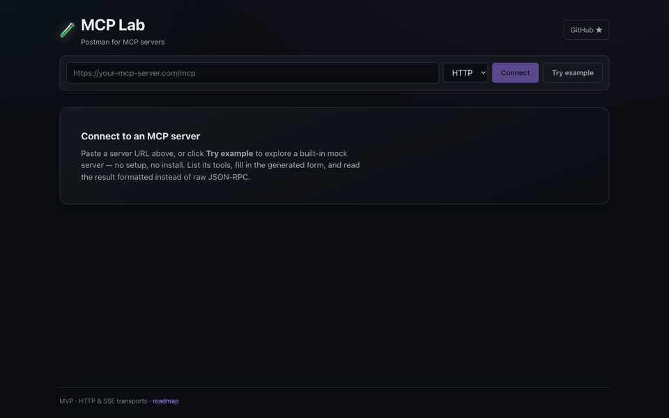

<div align="center">

# 🚛 fleet-mcp

### Fleet telemetry MCP server — give your AI agent eyes on the road.

[](https://github.com/ridzkyyy/fleet-mcp/actions/workflows/ci.yml)
[](./LICENSE)




*Live: [MCP Lab](https://mcp-lab.vercel.app) connecting to `https://fleet-mcp.vercel.app/mcp` — ask your agent "where is truck B 9114?" and this is what answers.*

</div>

---

## What is this?

AI agents can't answer *"where is truck B 9114 right now?"* unless something speaks both [MCP](https://modelcontextprotocol.io) **and** telematics. **fleet-mcp** is that bridge: an MCP server that exposes vehicle positions, trip history, geofence events, and NMEA parsing as typed tools any MCP client (Claude Desktop, IDEs, agents) can call.

It ships with a **deterministic simulated Jakarta logistics fleet** — six vehicles on real routes between Tanjung Priok port, a Cakung warehouse, and Bekasi/Cikarang. Positions are a pure function of wall-clock time, so there's no database, no background process, and the demo works the second you start it.

Built by someone who runs fleet telematics in production — the NMEA checksums, dwell times, and offline-vehicle semantics behave the way real trackers do.

## Quickstart

**Zero install — try it in your browser right now:**

1. Open [MCP Lab](https://mcp-lab.vercel.app)
2. Paste `https://fleet-mcp.vercel.app/mcp` and hit Connect
3. Run `get_fleet_summary` — the trucks are moving right now

**Claude Desktop / any stdio MCP client:**

```json
{
  "mcpServers": {
    "fleet": {
      "command": "npx",
      "args": ["-y", "github:ridzkyyy/fleet-mcp"]
    }
  }
}
```

**HTTP (for web clients like MCP Lab):**

```bash
git clone https://github.com/ridzkyyy/fleet-mcp.git
cd fleet-mcp && npm install && npm run build
node dist/index.js --http        # → http://localhost:8137/mcp
```

Then point any HTTP-transport MCP client at `http://localhost:8137/mcp` — or use the hosted endpoint `https://fleet-mcp.vercel.app/mcp` and skip the server entirely.

> **Note:** browsers enforce Local Network Access — connecting from a **hosted** HTTPS client to your localhost may require a permission prompt (Chrome). Hosted→hosted (the endpoint above) or local→local always works.

## Tools

| Tool | What it answers |
|------|-----------------|
| `list_vehicles` | "What's in my fleet and what is each unit doing?" |
| `get_vehicle_position` | "Where is B 9114 TRK right now?" (id or plate) |
| `get_trip_history` | "Show me v3's last 4 hours — distance, stops, speeds" |
| `list_geofences` | "What zones do we watch, and who's inside them?" |
| `get_geofence_events` | "Which trucks entered the port area overnight?" |
| `get_fleet_summary` | "Give me the morning ops snapshot" |
| `find_nearest_vehicle` | "Closest available unit to this pickup point?" |
| `parse_nmea` | "Decode this raw `$GPRMC…` burst from a tracker" |

Every tool validates input (Zod schemas), returns structured JSON, and reports errors as data instead of throwing — including NMEA checksum failures, which are listed per-sentence rather than silently dropped.

## How the demo fleet works

```
wall-clock time ──▶ route phase ──▶ position / speed / ignition
                     (pure function — no DB, no cron, no state)
```

Each route is a fixed cycle of dwells and drives. A vehicle's phase within its cycle derives from `now − EPOCH + offset`, which means:

- **Deterministic** — same timestamp always yields the same fix, so history is replayable
- **Always alive** — trucks are moving right now, whenever "now" is
- **Realistic** — dwell at the warehouse with ignition off, speed jitter that looks like traffic, one vehicle that went dark 3 hours ago (because real fleets always have one)

Geofence events (enter/exit) are computed by scanning the same deterministic track — `wh-cakung` (circle), `port-priok` (polygon), and `bekasi-dc` (circle) produce real event streams every cycle.

## Roadmap

- [x] Simulated fleet, 8 tools, stdio + Streamable HTTP
- [ ] **Adapter interface** — plug in a real data source
- [ ] MQTT ingestion adapter (live tracker feeds)
- [ ] Traccar adapter (the most-deployed OSS tracking server)
- [ ] MCP resources for fleet/geofence catalogs
- [ ] Alert prompts ("notify when X exits geofence Y")

## Development

```bash
npm install
npm test          # 37 tests: geo math, NMEA, simulator, end-to-end MCP client
npm run coverage  # ~85% statements
npm run dev       # HTTP mode with hot reload
```

PRs welcome — especially protocol adapters (Teltonika, Concox), geofence edge cases, and NMEA sentence coverage.

## Pairs with

🧪 **[MCP Lab](https://github.com/ridzkyyy/mcp-lab)** — Postman for MCP servers. Develop fleet-mcp tools, test them in MCP Lab, no agent in the loop.

## License

[MIT](./LICENSE)
